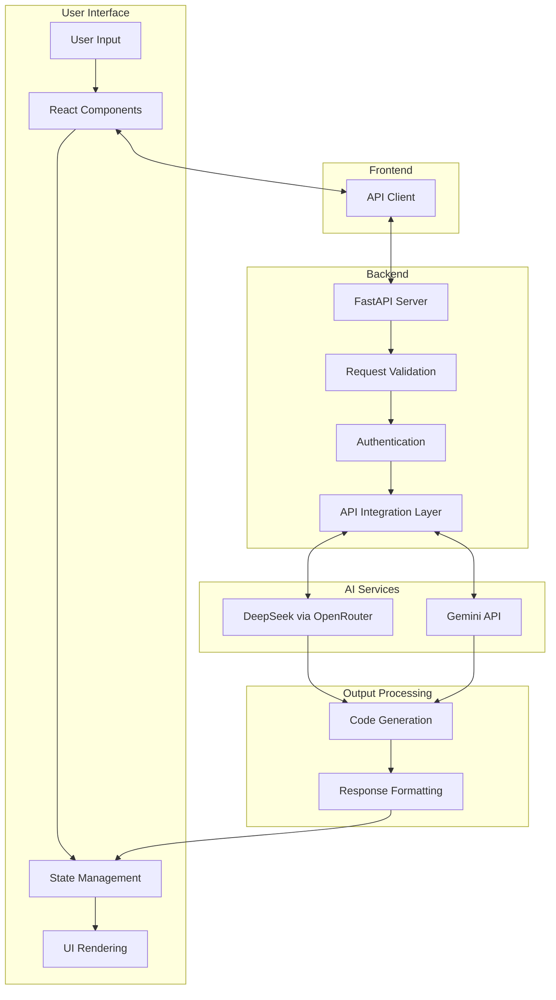

# 🚀 InfraGen AI

<div align="center">
  


**Transform your infrastructure ideas into reality with advanced AI technology**

[](https://reactjs.org/)
[](https://fastapi.tiangolo.com/)
[](https://vitejs.dev/)
[](LICENSE)

<a href="#features">✨ Features</a> •
<a href="#architecture">🏗️ Architecture</a> •
<a href="#getting-started">🚀 Getting Started</a> •
<a href="#usage">📝 Usage</a> •
<a href="#example-prompts">🎯 Examples</a>

</div>

<br/>

<div align="center">
  
</div>

## 📋 Overview

InfraGen AI is a powerful web application that transforms infrastructure requirements from natural language into production-ready code. By leveraging state-of-the-art AI models, we simplify the infrastructure-as-code process, allowing developers and DevOps engineers to focus on design rather than implementation details.

> 💡 **Our Mission**: To democratize infrastructure creation by making it accessible through natural language, regardless of your expertise level with specific cloud providers or IaC tools.

<br>

<table>
  <tr>
    <td width="50%" valign="top">
      <h3 align="center">✨ For Developers</h3>
      <p align="center">Focus on your application instead of infrastructure setup</p>
      <ul>
        <li>Quick prototypes without deep IaC knowledge</li>
        <li>Learn best practices by example</li>
        <li>Validate infrastructure designs</li>
      </ul>
    </td>
    <td width="50%" valign="top">
      <h3 align="center">💼 For DevOps Teams</h3>
      <p align="center">Accelerate infrastructure creation and standardization</p>
      <ul>
        <li>Generate baseline templates</li>
        <li>Standardize infrastructure patterns</li>
        <li>Reduce manual configuration errors</li>
      </ul>
    </td>
  </tr>
</table>

## ✨ Features

### 🤖 Advanced AI Models

<div style="display: flex; justify-content: space-between; margin-bottom: 20px;">
  <div style="flex: 1; padding: 10px; background: rgba(56, 189, 248, 0.1); border-radius: 8px; margin-right: 10px;">
    <h4>🧠 DeepSeek AI</h4>
    <p>Optimized for complex infrastructure requirements with advanced reasoning capabilities.</p>
    <ul>
      <li>Excellent for multi-tier architectures</li>
      <li>Strong understanding of cloud provider nuances</li>
      <li>Produces highly-optimized Terraform code</li>
    </ul>
  </div>
  <div style="flex: 1; padding: 10px; background: rgba(129, 140, 248, 0.1); border-radius: 8px;">
    <h4>💫 Gemini AI</h4>
    <p>Google's advanced model with broad infrastructure knowledge.</p>
    <ul>
      <li>Great for GCP infrastructure</li>
      <li>Balanced for general use cases</li>
      <li>Excellent for simpler deployments</li>
    </ul>
  </div>
</div>

### 🎨 Modern UI Experience

Our application features a stunning modern interface:

- **🌈 Dynamic Color Themes**: Elegant color scheme with smooth gradient highlights
- **🌟 Glassmorphism Effects**: Sleek, blurred glass-like elements for depth and sophistication
- **✨ Micro-interactions**: Subtle animations and visual feedback throughout the interface
- **🔄 Mouse Animation**: Interactive cursor animations that respond to movement
- **📱 Fully Responsive**: Optimized for desktop, tablet, and mobile devices

### 📝 Advanced Input Features

- **Character Count**: Real-time feedback on the length of your prompt
- **Form Validation**: Intelligent validation with context-aware guidance
- **Clickable Model Cards**: Interactive model selection with visual feedback
- **Placeholder Examples**: Helpful placeholders to guide your prompt writing

### 🖥️ Intelligent Code Output

- **⚡ One-Click Copy**: Instantly copy generated code with visual confirmation
- **💾 Save as File**: Download code directly as a ready-to-use .tf file
- **🔍 Syntax Highlighting**: Visually structured code for better readability
- **📏 Custom Scrollbars**: Elegant custom scrollbars for navigating long outputs

## 🎭 User Experience

<div align="center">
  
</div>

The InfraGen AI experience is designed to be intuitive and seamless:

1. **🏠 Landing Page**: Welcoming hero section that clearly explains the application's purpose
2. **🔍 Features Overview**: Informative cards highlighting the key benefits
3. **📝 Generation Form**: Intuitive form with clear guidance and model selection
4. **⏳ Loading States**: Engaging loading animations during code generation
5. **📊 Results Display**: Clean, organized presentation of the generated code
6. **🔄 Iteration**: Easy one-click option to start a new generation

## 🏗️ Architecture

InfraGen AI follows a modern client-server architecture with real-time communication:

<div align="center">
  


</div>

### Component Breakdown

| Component | Technology | Purpose |
|-----------|------------|---------|
| **Frontend** | React + Vite | User interface and state management |
| **API Client** | Fetch API | Communication with backend services |
| **Backend Server** | FastAPI | API endpoints and business logic |
| **AI Integration** | OpenAI Client, Requests | Communication with AI services |
| **Data Flow** | JSON | Structured data interchange between components |

## 🛠️ Tech Stack

Our application leverages a modern, optimized tech stack:

### Frontend
- **⚛️ React**: Component-based UI development with hooks for state management
- **🎨 Custom CSS**: Hand-crafted styling with CSS variables for theming
- **⚡ Vite**: Lightning-fast build tool with Hot Module Replacement (HMR)

### Backend
- **🚀 FastAPI**: High-performance, async-capable API framework
- **🐍 Python 3.7+**: Modern Python runtime for backend logic
- **🔐 Environment Variables**: Secure configuration management
- **🌐 CORS Support**: Cross-Origin Resource Sharing for frontend communication

### AI Integrations
- **🧠 OpenRouter**: API gateway for accessing DeepSeek AI
- **💬 Gemini API**: Direct integration with Google's Gemini model
- **🔄 Retry Logic**: Robust error handling with automatic retries

## 🚀 Getting Started

### Prerequisites

- **Node.js** (v16 or later)
- **Python** (v3.7 or later)
- **pnpm** (recommended) or npm
- API keys for OpenRouter and Gemini

### Installation

#### Backend Setup

```bash
# Navigate to the backend directory
cd project-root/backend

# Create and activate a virtual environment
python -m venv venv
source venv/bin/activate  # On Windows, use: venv\Scripts\activate

# Install dependencies
pip install -r requirements.txt

# Create a .env file with your API keys
echo "OPENROUTER_API_KEY=your_openrouter_api_key" > .env
echo "GEMINI_API_KEY=your_gemini_api_key" >> .env

# Start the backend server
uvicorn main:app --reload
```

#### Frontend Setup

```bash
# Navigate to the frontend directory
cd project-root/frontend

# Install dependencies
pnpm install

# Start the development server
pnpm dev
```

### Environment Configuration

Create a `.env` file in the backend directory with the following variables:

```env
# API Keys
OPENROUTER_API_KEY=your_openrouter_api_key
GEMINI_API_KEY=your_gemini_api_key

# Optional Configuration
DEBUG=False
LOG_LEVEL=INFO
```

## 🧩 Core Components

### 📋 InfraForm Component

The `InfraForm` component serves as the primary user input interface:

<div align="center">
  
</div>

Key features:
- **Prompt Textarea**: Rich text input with character counting
- **Model Selection**: Interactive model cards with visual selection state
- **Submit Button**: Context-aware button with loading states
- **Validation**: Real-time input validation with helpful messages

### 📊 Output Display

The output section provides a professional code viewing experience:

<div align="center">
  
</div>

Features:
- **Header Controls**: Title with copy button
- **Code Display**: Monospaced font with syntax highlighting
- **Action Buttons**: Save and run another query options
- **Visual Feedback**: Success states for copy operations

## 📝 Usage Guide

### Detailed Workflow

1. **Describe Your Infrastructure**
   - Be specific about resources needed
   - Mention cloud provider preferences
   - Include scaling requirements
   - Specify networking and security needs

2. **Select an AI Model**
   - DeepSeek: For complex, multi-resource setups
   - Gemini: For general-purpose infrastructure

3. **Generate Infrastructure**
   - Click the generate button
   - Wait for the AI to process (typically 5-15 seconds)

4. **Review & Use**
   - Examine the generated code
   - Copy for immediate use
   - Save as a file for version control
   - Make any necessary adjustments

### Pro Tips

> 💡 **For best results**: Include specific details about scaling, regions, and security requirements in your prompt.

> 💡 **Compare models**: Try the same prompt with different models to see variations in approach.

> 💡 **Iterative approach**: Start with a simple prompt and progressively add more details.

## 🎯 Example Prompts

### AWS Infrastructure

```
Create a highly available web application on AWS with:
- Auto-scaling EC2 instances (t3.medium) across 3 availability zones
- Application load balancer with SSL termination
- RDS PostgreSQL database with multi-AZ setup
- S3 bucket for static assets with CloudFront distribution
- VPC with public and private subnets
- Security groups limiting access appropriately
```

### Kubernetes Setup

```
Generate a Kubernetes configuration for a microservices application with:
- 3 services (user-service, product-service, order-service)
- Horizontal Pod Autoscaling based on CPU utilization
- Persistent volume claims for database services
- Ingress controller with path-based routing
- Resource limits and requests for all containers
- Prometheus monitoring and Grafana dashboards
```

### Multi-Cloud Architecture

```
Create a disaster recovery setup across AWS and Azure with:
- Primary workloads in AWS us-east-1
- Backup capability in Azure East US
- Automated data replication between clouds
- DNS-based failover mechanism
- Consistent security policies across both environments
- Cost optimization for the standby environment
```

## ⚙️ Configuration Options

The application supports various configuration options:

### Backend Environment Variables

| Variable | Description | Default |
|----------|-------------|---------|
| `OPENROUTER_API_KEY` | API key for OpenRouter service | Required |
| `GEMINI_API_KEY` | API key for Google's Gemini AI | Required |
| `DEBUG` | Enable debug mode | `False` |
| `LOG_LEVEL` | Logging verbosity | `INFO` |

### Frontend Configuration

Frontend settings can be adjusted in `src/config.js`:

```js
export const API_BASE_URL = "http://localhost:8000";
export const DEFAULT_MODEL = "deepseek";
export const MAX_RETRY_ATTEMPTS = 3;
```

## 🤝 Contributing

We welcome contributions from the community! Here's how you can help:

### Development Workflow

1. Fork the repository
2. Create your feature branch: `git checkout -b feature/amazing-feature`
3. Commit your changes: `git commit -m 'Add some amazing feature'`
4. Push to the branch: `git push origin feature/amazing-feature`
5. Open a Pull Request

### Contribution Areas

- **Frontend Enhancements**: UI/UX improvements, new components
- **Backend Features**: API enhancements, performance optimizations
- **AI Integration**: Support for additional models and providers
- **Documentation**: Examples, tutorials, and clear explanations
- **Testing**: Unit tests, integration tests, and bug reports

## 📜 License

This project is licensed under the MIT License - see the LICENSE file for details.

## 🔮 Roadmap

We're continuously improving InfraGen AI. Here's what's coming next:

- **🌐 Multi-Provider Support**: Additional cloud providers (GCP, Azure)
- **🔐 User Authentication**: Save and manage your generated infrastructures
- **📑 Template Gallery**: Community-shared infrastructure templates
- **📱 Mobile App**: Native mobile experience for on-the-go generation
- **🔧 Custom Parameters**: Fine-tune generated infrastructure with specific parameters

## 📞 Contact & Support

- **GitHub Issues**: For bug reports and feature requests
- **Email**: support@infragen-ai.example.com
- **Twitter**: [@InfraGenAI](https://twitter.com/)

---

<div align="center">
  
  <p>Built with ❤️ by the InfraGen AI Team</p>
  <p>© 2024 InfraGen AI. All rights reserved.</p>
</div>
